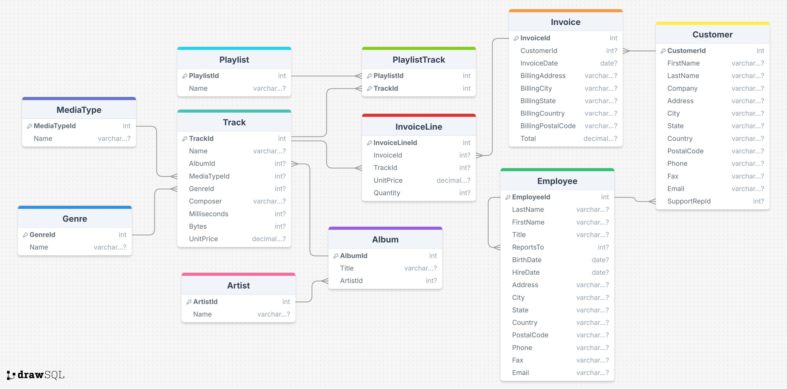

# Music Store Data Analysis



## Project Overview

This project provides an in-depth SQL analysis of a music store dataset, exploring customer behavior, sales patterns, geographic distribution, and product popularity. The analysis answers key business questions and provides actionable insights to drive business decisions.

## Dataset

The dataset contains information about a digital music store, including:

- Customer information
- Employee data
- Invoice and sales details
- Music tracks, albums, and artists
- Playlists and media types
- Genres and other music metadata

## Project Structure

```
music_store_analysis/
├── data/                      # Raw CSV data files
├── sql/                       # SQL scripts with questions, queries, and results
│   ├── 01_setup_database.sql  # Database and table creation
│   ├── 02_basic_analysis_with_results.md  # Basic analysis (Q1-Q5)
│   ├── 03_customer_analysis_with_results.md # Customer-focused analysis
│   ├── 04_music_analysis_with_results.md  # Music-focused analysis
│   ├── 05_sales_analysis_with_results.md  # Sales and financial analysis
│   ├── 06_geographic_analysis_with_results.md # Country/location analysis
│   └── 07_advanced_analysis_with_results.md # Additional advanced analysis
├── docs/                      # Documentation
│   ├── schema.md              # Database schema documentation
│   ├── data_dictionary.md     # Data dictionary explaining fields
│   ├── validation_report.md   # Data validation methodology and findings
│   └── merged_files_validation.md # Validation of merged analysis files
├── complete_music_store_analysis.md # Combined file with all analyses
└── data_quality_report.md     # Data quality assessment
```

## Key Business Questions Answered

Each analysis file contains the business question, SQL query, results, and business insights. All analyses are also available in the comprehensive `complete_music_store_analysis.md` file.

### Basic Analysis
1. Who is the senior most employee based on job title?
2. Which countries have the most invoices?
3. What are the top 3 values of total invoice?
4. Which city has the best customers for promotional events?
5. Who is the best customer based on spending?

### Customer Analysis
6. Who are the Rock Music listeners?
7. Who is the top customer in each country?

### Music Analysis
8. Who are the top Rock bands by track count?
9. Which tracks are longer than the average track length?
10. Who are the most popular artists?
11. What are the most popular songs?

### Sales Analysis
12. How much do customers spend on each artist?
13. What are the average prices of different types of music?

### Geographic Analysis
14. What is the most popular music genre in each country?
15. Which countries generate the most music purchases?

### Advanced Analysis
- Track length distribution by genre
- Employee sales performance
- Seasonal trends in music purchases
- Customer retention analysis
- Purchase frequency patterns

## Key Findings

### Customer Insights

- Top customers (R Madhav and Frank Harris) both spent $144.54
- Rock music is overwhelmingly popular across almost all countries
- The USA represents the largest market (131 invoices), followed by Canada (76) and Brazil (61)
- Customers make purchases approximately once per month (30.45 days average between purchases)

### Product Insights

- Iron Maiden is the most purchased artist (140 purchases), followed by U2 (107) and Metallica (91)
- Significant variation exists in track lengths across genres, with Sci Fi & Fantasy having the longest average tracks
- All genres are priced consistently at $0.99
- Led Zeppelin (114 tracks) and U2 (112 tracks) have the most rock tracks in the catalog

### Sales and Geographic Insights

- Prague generates the highest revenue ($90.24)
- The USA is by far the largest market with $523.06 in total sales
- Sales show remarkable consistency across months
- Jane Peacock is the top-performing sales representative with $833.04 in total sales

## Business Recommendations

1. Develop targeted marketing campaigns for rock music enthusiasts
2. Prioritize resources for the USA, Canada, Brazil, France, and Germany markets
3. Implement a tiered loyalty program to encourage repeat purchases
4. Consider testing different price points for premium content
5. Implement seasonal marketing campaigns to drive additional sales
6. Analyze top-performing sales representatives' techniques to identify best practices

## Installation and Usage

To run this project:

1. Set up a PostgreSQL database
2. Run the setup script in `sql/01_setup_database.sql` to create tables
3. Import the CSV files from the `data` directory
4. Review the analysis in either:
   - Individual analysis files in the `sql` directory
   - The comprehensive `complete_music_store_analysis.md` file

## Data Limitations

- Several tables contain missing values, particularly in optional fields
- The identical monthly sales figures suggest potential data limitations
- The analysis would benefit from longer-term data to identify true seasonal patterns

## License

This project is available for educational and practice purposes.

## Acknowledgments

- Original dataset source: Digital Music Store
- Analysis inspired by real-world business questions in the music retail industry
